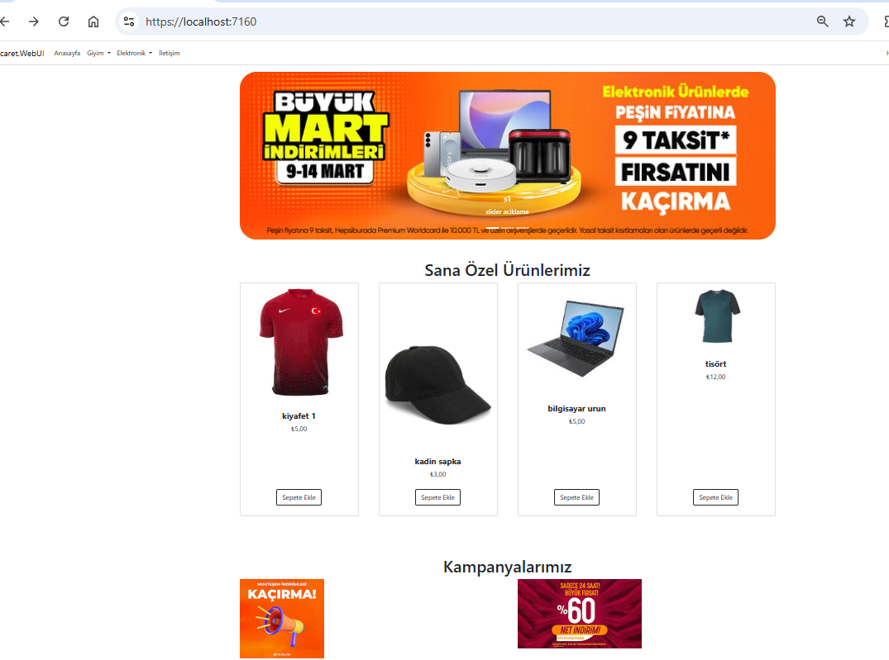
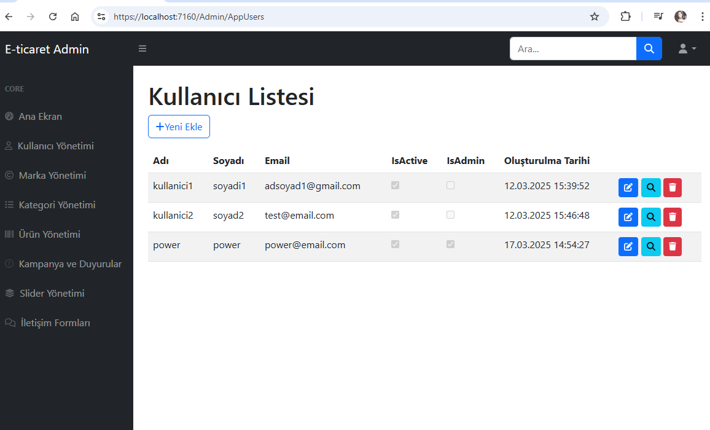
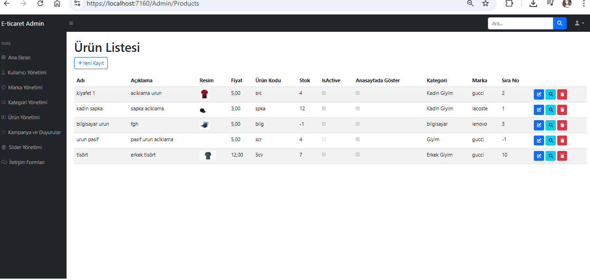
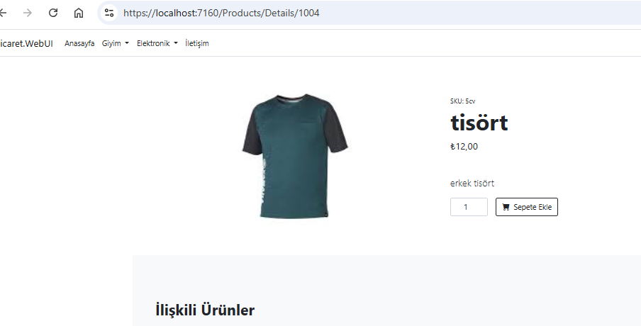

Bu proje, C# ve ASP.NET MVC teknolojileri kullanılarak geliştirilmiş, temel e-ticaret sitesinin kurumsal önyüzünü ve admin işlemlerini sunan bir web uygulamasıdır. 

*UDEMY platformundaki, Mesut Ilıca'nın Asp.NET Core MVC İle Sıfırdan E Ticaret Yazılımı Geliştirme eğitimi ilk 84 dersi paraleline geliştirilmiştir.*

 *Kategori Listeleme*,
*Ürün listeleme*,
*Kullanıcı kayıt/giriş işlemleri* gibi modülleri içermektedir.

## Özellikler
- Kullanıcı kayıt & giriş (authentication)
- Ürün listeleme & detay sayfası
- Arama özelliği
- Kategori bazlı filtreleme
- Yönetici paneli (ürün ,kategori , kullanıcı , duyuru, kampanya modulleri için ekleme, silme, güncelleme)

## Kullanılan Teknolojiler
**Backend:** ASP.NET MVC (.NET)

**ORM:** Entity Framework  

**Veritabanı:** SQL Server, Dependency Injection kullanıldı.

**Frontend:** Razor View, HTML, CSS, Bootstrap

## Ekran Görüntüleri

## Yapılacaklar
- Admin yönetim ekranlarında sıralama yapılırken farklı ürünlere aynı sıra verilmemesi sağlanacak.
- Database işlemleri için GenericRepository Pattern'e geçilecek. 
